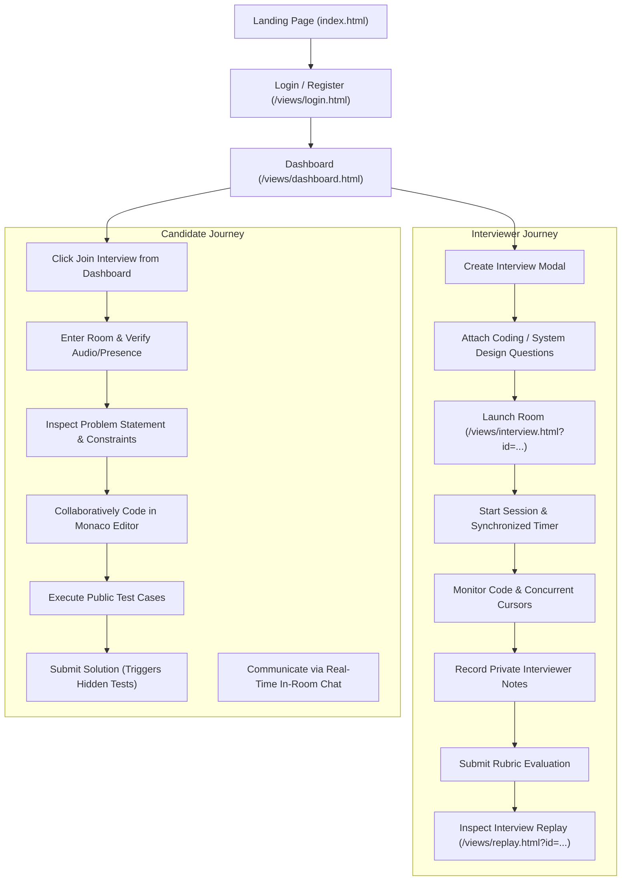
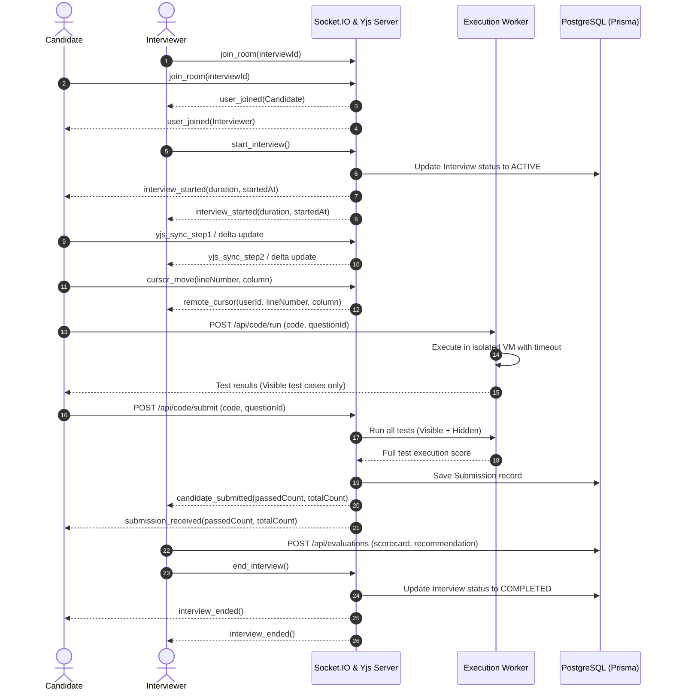

# APP-FLOW — Application Flow & User Journeys

## 1. High-Level Flow


---

## 2. Detailed State Machine Transitions

### Interview State Machine
```
[DRAFT]
   │
   ├── (Scheduled by Interviewer) ──> [SCHEDULED]
   │                                      │
   ├── (Cancelled before start) ──────────┼──> [CANCELLED]
   │                                      │
   └── (Interviewer clicks Start) ────────┴──> [ACTIVE]
                                                  │
   ┌──────────────────────────────────────────────┘
   │
   └── (Interviewer clicks End / Time expires) ──> [COMPLETED]
```

### Coding Session State Machine
```
[CREATED] (When candidate enters question)
   │
   ├── (Candidate types code) ────────────────> [ACTIVE]
   │                                              │
   ├── (Candidate clicks Submit) ─────────────────┴──> [SUBMITTED]
   │                                                      │
   └── (Interviewer scores & completes evaluation) ───────┴──> [EVALUATED]
```

---

## 3. Real-Time Event Sequence (Interview Session)


