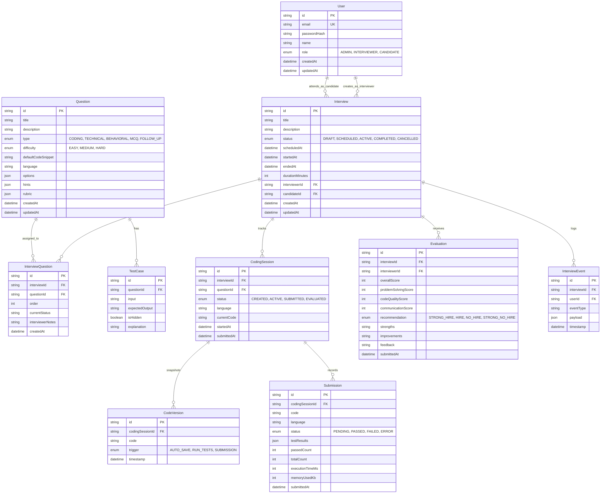

# Database Design & ERD — CodeArena

## 1. Relational Entity Overview
CodeArena uses **PostgreSQL** configured via **Prisma ORM**. The data model enforces strong relational consistency, cascade deletion where appropriate, and indexing on frequent query filters.

---

## 2. Indexing Strategy
- `User(email)`: Unique index for lightning-fast credential lookup.
- `Interview(interviewerId, status)`: Composite index for interviewer dashboards.
- `Interview(candidateId, status)`: Composite index for candidate dashboards.
- `InterviewQuestion(interviewId, order)`: Sorted question navigation.
- `TestCase(questionId, isHidden)`: Filtered query for visible test cases.
- `InterviewEvent(interviewId, timestamp)`: Sequential time-series retrieval for Interview Replay.
